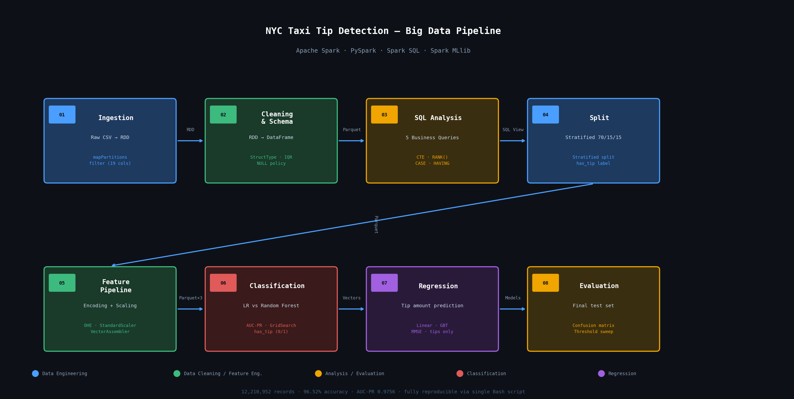

# taxi-tip-detector
# nyc-taxi-tip-detector

A PySpark pipeline that processes **12 million NYC taxi trips** to predict whether a passenger will leave a tip.

The focus of this project was on **big data handling and SQL analysis** rather than model optimization — building a clean, reproducible pipeline from raw CSV to trained models, and extracting meaningful business insights along the way using Spark SQL.

---

---

## What it does

- Ingests and cleans 12M+ records using the Spark RDD API with a manually enforced schema (`StructType`)
- Runs 5 analytical SQL queries (CTEs, window functions, conditional aggregation) to understand the data before modelling
- Builds a full Spark ML `Pipeline` with encoding, scaling, and feature engineering — fit only on training data to prevent leakage
- Trains and evaluates classification (tip / no tip) and regression (tip amount) models

## Key finding

Cash trips show a **0.00% tip rate** in the data — not because passengers don't tip, but because the taxi meter never records cash tips. This single insight, discovered through SQL analysis, filters every downstream stage to credit card trips only.

## Results

| Metric | Value |
|---|---|
| Records processed | 12,210,952 |
| Classification accuracy | 96.52% |
| AUC-PR | 0.9756 |

## Stack

Apache Spark · PySpark · Spark SQL · Spark MLlib · Python 3.11 · Parquet
